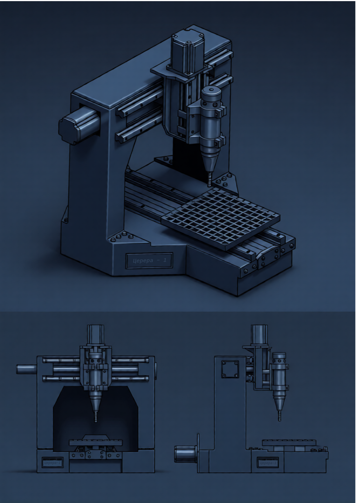

# Церера-1

Проект на ранней стадии разработки. Представляет собой сервер-эмулятор 3х-осевого фрезерного станка, работающий на **Boost.Asio** и **ROS 2** в паре с Android-приложением.



## Описание работы
(Раздел в разработке)

## Требования

- Linux
- CMake >= 3.20
- GCC >= 14
- Boost
- systemd

## Сборка

```bash
cmake -B build
cmake --build build
```
